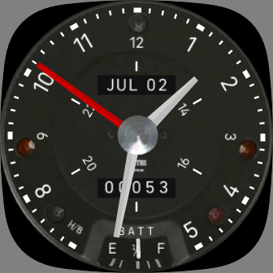
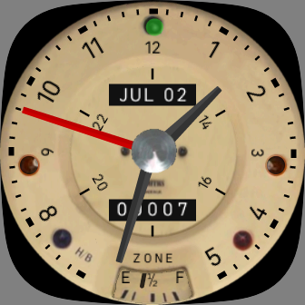

# fitbit-mini
## Analog clock with sensor info for Fitbit Versa 3 and Sense
### [Get this clock face from the Fitbit Gallery](https://gallery.fitbit.com/details/ee20db7e-81ed-49d6-89b2-79dcb149418d)
This is an analog clock based on the classic Mini Cooper speedometer, manufactured by Smiths. (The big one that sat right in the middle of the dashboard.) It includes selected sensor information. Included sensors are: 
+ Battery
+ Heart Rate
+ Steps
+ Distance
+ Active Zone Minutes

### Features ###
+ Dark and light modes can be toggled by tapping the center of the dial.
+ Sensors are displayed display in the fuel gauge at the bottom of the dial. Tap the bottom of the dial to change the sensor displayed.
+ Indicator lights around the edge of the clock face illuminate according to the currently selected sensor.
+ The battery light illuminates for low battery, regardless of the currently selected sensor.
+ The trip clock below the center of the dial shows the current count for the selected sensor. The
+ Date and time are displayed in the odometer.

This clock has only been tested on Fitbit Versa 3, so please feel free to submit a pull request with any improvements or bug fixes.
